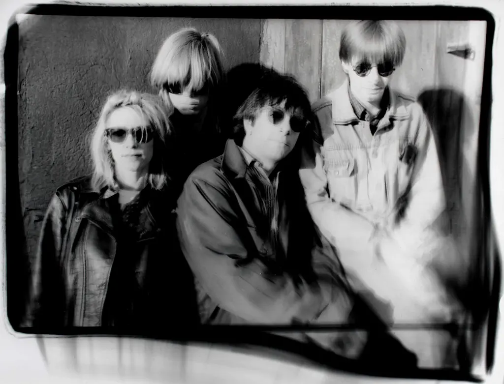

```{r setup, include=FALSE, eval=TRUE}
library(tidyverse)
library(tidytext)
library(tidymodels)
library(caret)
library(quanteda)
library(quanteda.textstats)
library(geniusr)
library(tictoc)
library(knitr)
library(wordcloud)
library(hrbrthemes)
library(stm)
library(furrr)
library(topicmodels)
library(ldatuning)
library(topicdoc)

# Genius token: frBVSmYqTcAm9awzKE8HeNrsXFTSv_5cjdrFBTUh3oUnughftDiSBXf-V0UB5OZ2

# get the stopwords from the SMART source in tidytext stopwords
smart_stopwords = get_stopwords(source = "smart")
smart_stopwords = smart_stopwords$word

# define some color pals
punk_colors = rep(c("#453E46", "#CF3E60", "#E68A5D", "#C9C79A", "#57989D"),3)
sy_colors = c("#832B27", "#CD5A42", "#B7C3DF", "#63666B")

# Some helpers
albums_by_year = c("Confusion Is Sex", "Bad Moon Rising", "EVOL",
                    "Sister", "Daydream Nation", "Goo ", "Dirty",
                    "Experimental Jet Set, Trash and No Star",
                    "Washing Machine", "A Thousand Leaves", 
                    "NYC Ghosts & Flowers", "Murray Street", "Sonic Nurse",
                    "Rather Ripped", "The Eternal")

lyrics = readRDS("./interim/sonic_youth_lyrics_clean.RDS")
```
by Dominik Freunberger
<br/><br/>
[](https://classicalbumsundays.com/album-of-the-month-sonic-youth-daydream-nation/)
<br/><br/>

|          ***Can you please pass me a jug of winter light?***
|          ***Fold me in an ocean's whim?***
|          ***In sweet corrosive fire light?***
|          ***In the city made of tin?***
|          ***Are you famous under the skin?***
|          ***Familiar with the things you wanted?***
|          ***Able now to take it all in?***
|          ***Making peace with every hole in the story?***
|          (From the song [*NYC Ghosts & Flowers*)](https://www.youtube.com/watch?v=bqnkMEnU0iI)

<br/> The NYC no wave/noise rock/post punk band **Sonic Youth** is not
only known for their eccentric noise landscapes but equally well for
their intricate lyrics deeply rooted in the tradition-less tradition of
modern American poetry.

Here I will take a deep dive into the words of the band's 15 studio
records between 1983 and 2009.

I'll get the lyrics from Genius' API. You need a genius account and
create an API client on <https://genius.com/api-clients> for this.

```{r get-lyrics, eval=FALSE, include=TRUE, message=FALSE}
# enter genius token when prompted:
genius_token()

# Find artist ID for Sonic Youth
artist = search_artist("sonic Youth")
songs = get_artist_songs_df(artist$artist_id) 

# Get all song IDs
ids = c(as.character(songs$song_id))

# Create empty dataframe for the lyrics
lyrics = data.frame()

# Add lyrics to df. This takes a long while.
# for (id in ids) {
#   lyrics = rbind(get_lyrics_id(id), lyrics)
#   print(id)
# }

# The loop above crashes after a while for an unknown reason. 
# I found the solution below on
# https://www.r-bloggers.com/2021/01/scraping-analysing-and-visualising-lyrics-in-r/
tic()
while (length(ids) > 0) {
  for (id in ids) {
    tryCatch({
      lyrics = rbind(get_lyrics_id(id), lyrics)
      successful = unique(lyrics$song_id)
      ids = ids[!ids %in% successful]
      print(paste("done - ", id))
      print(paste("New length is ", length(ids)))
    }, error = function(e){})
  }
}
toc()

lyrics_raw = lyrics
saveRDS(lyrics_raw, "./interim_data/sonic_youth_lyrics_raw.RDS")

# it get's only 277 of 419 songs listed on Genius; reason unknown. But okej.
# add album info
all_ids = data.frame(song_id = unique(lyrics$song_id))
all_ids$album = ""

for (song in all_ids$song_id) {
  all_ids[match(song,all_ids$song_id),2] = get_song_df(song)[12]
  print(song)
}

# join lyrics with album, year, and lyrics writer id
lyrics = full_join(all_ids, lyrics)

# get rid of unused cols and rename them
lyrics = lyrics %>% 
  select(artist_name, album, song_name, song_id, section_name, line) %>% 
  rename(artist = artist_name, song = song_name, section = section_name)

saveRDS(lyrics, "./interim/sonic_youth_lyrics_clean.RDS")
```

Instead of the 419 songs listed on Genius, we get only 276 (reason still
unknown). Anyway, let's see what we've got.

```{r preview-data, eval=TRUE, results="show"}
lyrics %>% 
  group_by(album) %>% 
  summarize(nr_of_songs = n_distinct(song)) %>% 
  arrange(desc(nr_of_songs)) %>% 
  kable()
```

**What a busy band!** A lot of what we got are singles, special
editions, anniversary bonus tracks, demos, etc. To keep it simple, let's
focus only on their 15 fabulous studio albums. That's still 154 songs.

```{r filter-studio-albums, message=FALSE, results="show"}
studio_albums = lyrics %>% 
  group_by(album) %>% 
  summarize(nr_of_songs = n_distinct(song)) %>% 
  filter(nr_of_songs > 6,
         !album %in% c("Walls Have Ears", "Goo Demos")) %>% 
  select(album)

lyrics_studio = lyrics %>% 
  filter(album %in% studio_albums$album)

lyrics_studio %>% 
  group_by(album) %>% 
  summarize(nr_of_songs = n_distinct(song)) %>% 
  arrange(desc(nr_of_songs)) %>%
  kable()
```

```{r get-meta-info, message=FALSE, warning=FALSE, eval=FALSE, results = "hide"}
song_meta_info = data.frame()

for (song in unique(lyrics$song_id)) {
  song_meta_info_temp =  data.frame(song_id = song,
                                    album_name = get_song(song)$content$album$name, 
                                    year = get_song(song)$content$release_date_for_display,
                                    lyrics_owner_id = get_song(song)$content$lyrics_owner_id)
  song_meta_info = rbind(song_meta_info, song_meta_info_temp)
  print(song)
  rm(song_meta_info_temp)
}
song_meta_info$year = as.numeric(song_meta_info$year)

lyrics_studio = lyrics_studio %>% 
  left_join(song_meta_info) %>% 
  arrange(year) %>% 
  mutate(year = as.numeric(str_sub(year,-4,-1))) %>% 
  select(artist, album, year, lyrics_owner_id, song, song_id, line)

# some dates got messed up
lyrics_studio$year[lyrics_studio$album=="Sonic Nurse"] = 2004
lyrics_studio$year[lyrics_studio$album=="Bad Moon Rising"] = 1985
saveRDS(lyrics_studio, "./interim_data/sonic_youth_lyrics_studio_albums.RDS")
```

**Nice!** Sonic Youth's lyrical style is heavily influenced by poetry,
often reminiscent of the Beat Generation and contemporary [American
poetry](https://en.wikipedia.org/wiki/American_poetry). But, as singer
and guitar player Thurston Moore puts it, ["lyrics really need rhyme to
serve the
song".](https://www.theguardian.com/music/2017/apr/09/thurston-moore-sources-of-inspiration-sonic-youth)
So it's not *just* poetry. <br/> Let's explore the words in this noise
rock landscape!

### Which Sonic Youth album has most words?

```{r plot-words-per-records, message=FALSE, warning=FALSE, results = "hide"}
lyrics_studio = readRDS("./interim/sonic_youth_lyrics_studio_albums.RDS")

lyrics_studio %>% 
  mutate(words_per_line = sapply(strsplit(line, " "), length)) %>% 
  group_by(year, album) %>% 
  summarize(number_of_words = sum(words_per_line)) %>% 
  ggplot(aes(x = reorder(album, -year), y = number_of_words)) + 
  geom_col(fill = punk_colors[3])+
  coord_flip()+
  theme_ipsum() +
  labs(x = "Album by year",
       y = "Number of words",
       title = "Number of words per album",
       subtitle = "A simple word count of every studio album's lyrics")
```

It seems the lyrics got longer until the release of "Dirty" in 1992, but
then slightly shorter again. This doesn't tell us much about their
lyrical power yet, since more words can be due to more songs on a
record. Let's look at the number of words in each of their songs
instead.

### Repetition and noise: How long are Sonic Youth's lyrics?

A quick and dirty count of words per song.

```{r plot-words-per-song, message=FALSE, results = "hide"}
words_per_song = lyrics_studio %>% 
  group_by(year, album, song) %>% 
  # paste all the lines per album
  summarize(album_lyrics = paste0(line, collapse = " ")) %>%
  # replace commas (they sometimes have no space afterwards, e.g. test,test)
  mutate(album_lyrics = gsub("\\,", " ", album_lyrics)) %>%
  # lowercase the words
  mutate(album_lyrics = tolower(album_lyrics)) %>%
  # delete special characters
  mutate(album_lyrics = str_replace_all(album_lyrics, "[[:punct:]]", " ")) %>% 
  filter(song != "Confusion is Sex - Album Art") %>%
  mutate(unique_words_per_song = sapply(strsplit(album_lyrics, " "), unique)) %>% 
  mutate(number_unique_words_per_song = as.numeric(lapply(unique_words_per_song, length))) %>% 
  arrange(desc(number_unique_words_per_song))

# let's get the shortest and the longest
short_long = words_per_song %>% 
  filter(number_unique_words_per_song > 200 | number_unique_words_per_song < 6)

ggplot(data = words_per_song, aes(x = reorder(album, -year), y = number_unique_words_per_song, label = song)) +
  geom_point(shape = 1, size = 3.3, color = punk_colors[5], alpha = 0.7, stroke = 1) +
  geom_point(data = short_long, 
             aes(x = reorder(album, number_unique_words_per_song), 
                 y = number_unique_words_per_song),
             shape = 1, size = 3.3, color = punk_colors[3], stroke = 1) +
  geom_text(aes(label=ifelse(number_unique_words_per_song<6,as.character(song),'')),hjust=-0.1,vjust=0, size = 3) +
  geom_text(aes(label=ifelse(number_unique_words_per_song>200,as.character(song),'')),hjust=1.05,vjust=0, size = 3) + 
  theme(legend.position = "none") +
  coord_flip()+
  theme_ipsum() +
  labs(x = "Album by year",
       y = "Number of words",
       title = "Unique words in each song",
       subtitle = "A count of unique words in every studio album's lyrics album")

```

|          ***Lightning***
|          ***Lightning strike***
|          ***Lightning strikes***
|          ***Lightning strike me***
|          ***Lightning strikes me***
|          ***Lightning strike me down***
|          ***Lightning strikes me down***

<br/>

|          ***Lightning***
|          ***Lightning strike***
|          ***Lightning strikes***
|          ***Lightning strike me***
|          ***Lightning strikes me***
|          ***Lightning strike me down***
|          ***Lightning strikes me down***

|          (From the song [*Lightning*)](https://www.youtube.com/watch?v=N_64Sh42uW4)

<br/> Repetitive lyrics always get me! Five unique words (because we did
not stem *strikes* to *strike*, yet)! Though, admittedly, this closing
song is clearly an ode to anti-art and rather a convulsion of guitar
squeaks and spoken boredom. <br/> The other end of this spectrum marks
the song [*In the Kingdom
\#19*](https://www.youtube.com/watch?v=jUegc5J8iZk), a gripping [piece
of poetry](https://genius.com/Sonic-youth-in-the-kingdom-19-lyrics) with
dystopic guitars that seems to be a young descendant of
[*Howl*](https://www.poetryfoundation.org/poems/49303/howl). 230 unique
words, and, except for the chorus, quite the opposite of repetitiveness.
<br/> Now that we have some ballpark figures about how short or long
their lyrics are, let's have a look at what words they actually use (a
lot).

### Which words tho, which words?

```{r process-tokens, results="hide", warning=FALSE}
# Tokenize the lines
# use what = "word1" so that remove twitter works
lyrics_studio_tokens = tokens(lyrics_studio$line, what = "word1", 
                               remove_numbers = TRUE, remove_punct = TRUE,
                               remove_symbols = TRUE, remove_hyphens = TRUE,
                               remove_twitter = TRUE)

# Stem the tokens
lyrics_studio_tokens = tokens_wordstem(lyrics_studio_tokens, language = "english")

# Lowercase the tokens
lyrics_studio_tokens = tokens_tolower(lyrics_studio_tokens)

# Remove stopwords
lyrics_studio_tokens = tokens_remove(lyrics_studio_tokens, 
                                      c(stopwords("english"), 
                                        smart_stopwords, "you'r"))

# Add bigrams and trigrams to our feature matrix
lyrics_studio_tokens <- tokens_ngrams(lyrics_studio_tokens, n = 1:3)

# Create bag-of-words model (document frequency matrix/ dfm)
lyrics_dfm = dfm(lyrics_studio_tokens, tolower = FALSE)

# calculate frequencies
word_freq = textstat_frequency(lyrics_dfm, n = 200)
```

```{r wordcloud, results="hide"}
# word cloud with the n most frequent terms
set.seed(42)
wordcloud(words = word_freq$feature, 
          freq = word_freq$frequency, max.words = 100,
          random.order = FALSE,         
          color = sy_colors)
```

LOVE! DREAM! KISS! FREE! UH UH UH! LALALALALALALALALAAAAAAH! Can't
escape the feeling. And many of the words immediately trigger a song
([*I wish I could be music on a*
***tree***](https://www.youtube.com/watch?v=pKlbBgQHPqo)). And the
[Ohrwurm](https://en.wiktionary.org/wiki/Ohrwurm) begins... <br/> Let's
have a look at Sonic Youth's most used words and in how many songs are
they sung. Note that the words look a bit strange (babi???) because they
have been [stemmed](https://en.wikipedia.org/wiki/Stemming).

```{r frequent_words, message=FALSE, results="show"}
# word cloud with the n most frequent terms
frequent_words = as.data.frame(word_freq)
frequent_words %>% 
  select(feature, frequency, docfreq) %>% 
  rename(word = feature, number_of_songs = docfreq) %>% 
  top_n(20) %>% 
  kable()
```

Love: 144 times in 107 songs! So there's love in almost 70 percent of
their studio songs. Then there are songs like [*I love her all the
time*](https://www.youtube.com/watch?v=EW3VlsRM0yE), in which - after a
mesmerizing six minute long guitar frantic - Thurston Moore keeps on
repeating ["I love her all the
time"](https://genius.com/Sonic-youth-i-love-her-all-the-time-lyrics).
<br/> 
Words are words are words but what are the topics Sonic Youth sings about? Let's do some topic modeling.

### But what are they singin bout? Modeling topics in Sonic Youth's lyrics.

First, let's check the most important words for each album. We can do this by calculating the relative importance with a measure called [tf-idf.](https://monkeylearn.com/blog/what-is-tf-idf/)
```{r checkingtd-idf, eval=TRUE, message=FALSE, fig.dim = c(14,10)}
lyrics_studio = readRDS("./interim/sonic_youth_lyrics_studio_albums.RDS")

tidy_lyrics = lyrics_studio %>%
  drop_na() %>% 
  unnest_tokens(word, line, token = "words") %>%
  anti_join(get_stopwords()) %>%
  filter(!str_detect(word, "[0-9]+")) %>%
  add_count(word) %>%
  select(-n)

lyrics_tf_idf = tidy_lyrics %>%
    count(album, word, sort = TRUE) %>%
    bind_tf_idf(word, album, n) %>%
    arrange(-tf_idf) %>%
    group_by(album) %>%
    top_n(10) %>%
    ungroup

lyrics_tf_idf %>%
    mutate(word = reorder_within(word, tf_idf, album),
           album = factor(album, levels=albums_by_year)) %>%
    ggplot(aes(word, tf_idf, fill = album)) +
    geom_col(alpha = 0.8, show.legend = FALSE, fill = punk_colors[2]) +
    facet_wrap(~ album, scales = "free", ncol = 5) +
    scale_x_reordered() +
    coord_flip() +
    theme(strip.text=element_text(size=11)) +
    theme_ipsum()+
    labs(x = NULL, y = "tf-idf",
         title = "The most important words for each album",
         subtitle = "Highest tf-idf words in Sonic Youth's albums")
```

</br>
So, _inhuman_ is an important word for the record "Confusion is Sex". Why could that be?
</br></br>

|          ***Complete inhuman***
|          ***Complete inhuman***
|          ***Complete inhuman***
|          ***Complete inhuman***
|          ***Inhu-inhuman***
|          ***Inhu-inhuman***
|          ***Inhuman***
|          ***Inhuman***
|          ***Inhuman***
|          ***Inhuman***
|          ***Inhuman***
|          ***Inhuman***
|          (From the song [*Inhuman*)](https://www.youtube.com/watch?v=elVZgK9ZRoE)
</br>
Oh, I see. Likewise, _goo_ seems to be important on the record "Goo". Here's why:
</br></br>

|          ***Goo Goo Goo***
|          ***Goo Goo Goo***
|          ***Goo Goo Goo***
|          ***My friend Goo***
|          ***Goo Goo Goo***
|          ***Talkin' 'bout Goo***
|          ***Goo Goo Goo***
|          ***My friend Goo***
|          ***Goo Goo Goo***
|          ***You would too***
|          ***Goo***
|          (From the song [*Goo*)](https://www.youtube.com/watch?v=kfwIFTsx8WE)
</br>
Makes sense. So do the words for the other albums (Ohrwurm triggered again). And the words themselves make pretty nice poetry as well:
</br></br>

|          ***Uh***
|          ***La***
|          ***Poison Arrow***
|          ***Whoa!***

</br></br>

__Grymt!__ Now that we know that the individual albums have _very_ different most important words, we got a first idea of  lyrical force of Sonic Youth.
</br></br>
To get a better understanding of the themes they sing about, we can train a model that extracts topics from the lyrics. Here, we do this with an [LDA](https://en.wikipedia.org/wiki/Latent_Dirichlet_allocation) [topic model.](https://en.wikipedia.org/wiki/Topic_model)
</br></br>

```{r topic-model-setup, eval=FALSE, message=FALSE, include=FALSE, results="hide"}
# convert dfm to topicmodels object
lyrics_topicmodel <- convert(lyrics_dfm, to = "topicmodels")
saveRDS(lyrics_topicmodel, "./interim/lyrics_topicmodel.RDS")
# First, we test what's the optimal number of topics.
# Time the code execution
start_time <- Sys.time()

n_of_topics <- FindTopicsNumber(
  lyrics_topicmodel,
  topics = seq(from = 5, to = 80, by = 5),
  metrics = c("Griffiths2004", "CaoJuan2009", "Arun2010", "Deveaud2014"),
  method = "Gibbs",
  control = list(seed = 77),
  mc.cores = 4L,
  verbose = TRUE
)

# clock time
end_time <- Sys.time()
time_passed <- end_time - start_time
print(time_passed)

saveRDS(n_of_topics, "./interim/number_of_topics_for_plotting.RDS")
```

```{r plot-k-test, eval=FALSE, include=FALSE}
n_of_topics = readRDS("./interim/number_of_topics_for_plotting.RDS")
FindTopicsNumber_plot(n_of_topics)
````

```{r topic-model-train, message=FALSE, results="show", eval=FALSE}
#Run LDA() from topicmodels package with n_topics; doesn't take long
lyrics_topicmodel = readRDS("./interim/lyrics_topicmodel.RDS")

# Time the code execution
start_time <- Sys.time()

n_topics = 15
lyrics_topicmodel_15 <- LDA(lyrics_topicmodel, n_topics)

# clock time
end_time <- Sys.time()
time_passed <- end_time - start_time
print(time_passed)

saveRDS(lyrics_topicmodel_15, "./interim/lyrics_topicmodel_15.RDS")
```
```{r get model metrics, eval=TRUE, fig.dim = c(14,10), include=FALSE}
# Get model metrics with topic doc package
# See http://mallet.cs.umass.edu/diagnostics.php for interpretation of measures
# get model
lyrics_topicmodel_15 = readRDS("./interim/lyrics_topicmodel_15.RDS")
lyrics_topicmodel = readRDS("./interim/lyrics_topicmodel.RDS")

# run diagnostics on model
diagnostics_df = topic_diagnostics(lyrics_topicmodel_15, lyrics_topicmodel)

# arrange the metrics
diag_df = diagnostics_df %>%
  mutate(topic_label = topicmodels::terms(lyrics_topicmodel_15, 5) %>%
           apply(2, paste, collapse = ", "),
         topic_label = paste(topic_num, topic_label, sep = " - "))

# plot the model metrics
diag_df %>% 
  gather(diagnostic, value, -topic_label, -topic_num) %>%
  ggplot(aes(x = topic_num, y = value,
             fill = str_wrap(topic_label, 25))) +
  geom_bar(stat = "identity", fill = punk_colors[5]) +
  theme_ipsum()+
  facet_wrap(~diagnostic, scales = "free") +
  labs(x = "Topic Number", y = "Diagnostic Value",
       fill = "Topic Label", title = "All Topic Model Diagnostics")

# Second, get the perplexity score of the entire model
# perplexity_score = perplexity(lyrics_topicmodel_15)
# perplexity_score
```

```{r plot-model, results='hide', fig.dim = c(14,10)}
# transform into tidy data frame
lyrics_topics = tidy(lyrics_topicmodel_15, matrix = "beta")

# for each topic, obtain the top 10 words by beta
lyrics_topics_words = lyrics_topics %>%
  group_by(topic) %>%
  top_n(10, beta) %>%  # top words based on informativeness
  ungroup() %>%
  arrange(topic, beta) %>%
  mutate(order = row_number()) 

# plot
ggplot(lyrics_topics_words, aes(order, beta, fill = factor(topic))) +
  geom_col(show.legend = FALSE, fill = sy_colors[2]) +
  facet_wrap(~ topic, scales = "free", ncol = 5) +
  theme_ipsum() +
  # Add categories to axis
  scale_x_continuous(
    breaks = lyrics_topics_words$order,
    labels = lyrics_topics_words$term,
    expand = c(0,0)
  ) +
  coord_flip()
```
</br></br>
We asked the model to extract 15 topics from all the lyrics and 15 topics we got! Let's first look at how common they are and how they distribute over the individual records, and then zoom in a bit more.
</br></br>
And, note again that some of the words look strange because they have been modified to make it easier for a computer to understand them (e.g., _nature_ becomes _natur_, _something_ becomes _someth_)

``` {r plot-topics2, eval=TRUE, fig.dim = c(8,6)}
# Get Bet and Gamma values
td_beta = tidy(lyrics_topicmodel_15, matrix=c("beta"))
#td_beta
td_gamma = tidy(lyrics_topicmodel_15, matrix = "gamma")
#td_gamma

# arrange and plot
top_terms = td_beta %>%
  arrange(beta) %>%
  group_by(topic) %>%
  top_n(7, beta) %>%
  arrange(-beta) %>%
  select(topic, term) %>%
  summarise(terms = list(term)) %>%
  mutate(terms = map(terms, paste, collapse = ", ")) %>% 
  unnest()

gamma_terms = td_gamma %>%
  group_by(topic) %>%
  summarise(gamma = mean(gamma)) %>%
  arrange(desc(gamma)) %>%
  left_join(top_terms, by = "topic") %>%
  mutate(topic = paste0("Topic ", topic),
         topic = reorder(topic, gamma))

gamma_terms %>%
  ggplot(aes(topic, gamma, label = terms, fill = topic)) +
  geom_col(show.legend = FALSE, fill = punk_colors[4]) +
  geom_text(hjust = 0, nudge_y = 0.0005, size = 3) +
  coord_flip() +
  scale_y_continuous(expand = c(0,0),
                     limits = c(0, 0.13),
                     labels = percent_format()) +
  theme_ipsum() +
  labs(x = NULL, y = expression(gamma),
       title = "Top 20 topics by prevalence in the 1 % stratified random sample",
       subtitle = "With the top words that contribute to each topic")

```
