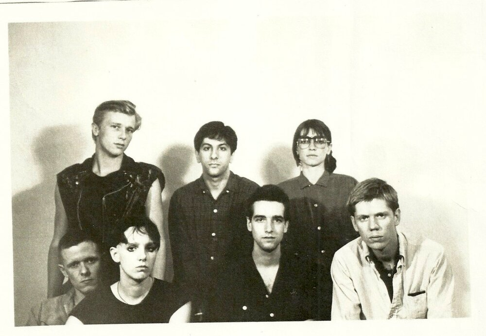
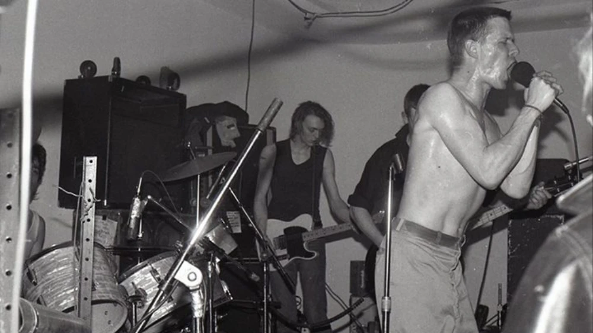
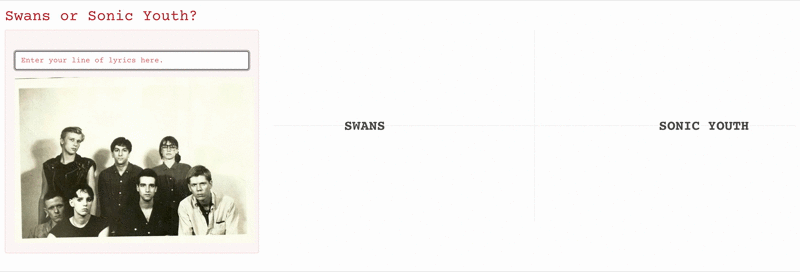

```{r setup, include=FALSE, eval=TRUE}
library(tidyverse)
library(tidytext)
library(tidymodels)
library(caret)
library(quanteda)
library(quanteda.textstats)
library(geniusr)
library(tictoc)
library(knitr)
library(wordcloud)
library(hrbrthemes)
library(stm)
library(furrr)
library(topicmodels)
library(ldatuning)
library(topicdoc)
library(gridExtra)
library(widyr)
library(ggraph)
library(igraph)
library(irlba)
library(doParallel)
library(lsa)
library(randomForest)
library(keras)
library(ggforce)
library(shiny)
library(reticulate)


# Genius token: frBVSmYqTcAm9awzKE8HeNrsXFTSv_5cjdrFBTUh3oUnughftDiSBXf-V0UB5OZ2

# get the stopwords from the SMART source in tidytext stopwords
smart_stopwords = get_stopwords(source = "smart")
smart_stopwords = c(smart_stopwords$word, "we'r")

# define some color pals
sw_colors = c("#AE9166", "#AE2223", "#FFB50D", "#535250")
sy_colors = c("#832B27", "#CD5A42", "#B7C3DF", "#63666B")
other_colors = rep(c("#453E46", "#CF3E60", "#E68A5D", "#C9C79A", "#57989D"),3)

# Some helpers
sw_albums_year = data.frame(album = c("Filth", "Cop", "Greed", "Holy Money", "Children of God",
                      "The Burning World", "White Light from the Mouth of Infinity",
                      "Love of Life", "The Great Annihilator", "Soundtracks for the Blind",
                      "My Father Will Guide Me Up a Rope to the Sky", "The Seer",
                      "To Be Kind", "The Glowing Man", "leaving meaning."),
                      year = c(1983, 1984, 1986, 1986, 1987, 1989, 1991, 1992,
                      1995, 1996, 2010, 2012, 2014, 2016, 2019))

sw_albums_by_year = sw_albums_year$album

sy_albums_year = data.frame(album = c("Confusion Is Sex", "Bad Moon Rising", "EVOL",
                    "Sister", "Daydream Nation", "Goo", "Dirty",
                    "Experimental Jet Set, Trash and No Star",
                    "Washing Machine", "A Thousand Leaves", 
                    "NYC Ghosts & Flowers", "Murray Street", "Sonic Nurse",
                    "Rather Ripped", "The Eternal"),
                    year = c(1983, 1985, 1986, 1987, 1988, 1990, 1992, 1994,
                             1995, 1998, 2000, 2002, 2004, 2006, 2009))
                    
sy_albums_by_year = sy_albums_year$album

```
by Dominik Freunberger
<br/><br/>
[](https://www.reddit.com/r/OldSchoolCool/comments/m303cy/members_of_the_bands_that_would_become_sonic/)
<br/><br/>

|      ***No pain, no death, no fear, no hate***
|      ***No time, no now, no suffering***
|      ***No touch, no loss, no hand, no sense***
|      ***No wound, no waste, no lust, no fear***
|      ***No mind, no greed, no suffering***
|      ***No thought, no hurt, no hands to reach***
|      ***No knife, no words, no lie, no cure***
|      ***No need, no hate, no will, no speech***
|      (From the Swans song [*Screen Shot*)](https://www.youtube.com/watch?v=6qDq9eGUmMI)
<br/><br/>

|      ***Can you please pass me a jug of winter light?***
|      ***Fold me in an ocean's whim?***
|      ***In sweet corrosive fire light?***
|      ***In the city made of tin?***
|      ***Are you famous under the skin?***
|      ***Familiar with the things you wanted?***
|      ***Able now to take it all in?***
|      ***Making peace with every hole in the story?***
|      (From the Sonic Youth song [*NYC Ghosts & Flowers*)](https://www.youtube.com/watch?v=bqnkMEnU0iI)

<br/> <br/> 
The NYC no wave/noise rock/post punk bands **Sonic Youth** and **Swans** are not
only known for their eccentric and hypnotic noise landscapes but equally well for
their intricate lyrics. While Sonic Youth's lyrics are deeply rooted in the tradition-less tradition of
modern American poetry, listening to Swans often is reminiscent of going to a church full of noise when singer Michael Gira recites his ecclesiastical texts in their maelstrom of noise. What both bands share is their love for repetition and noise.

Here, I will take a deep dive into the words of each of the two bands' 15 studio
records between 1983 and 2019 and provide different perspectives on some features of their lyrical craft. We'll see some (uncanny) commonalities and defining differences. Some of the questions I try to answer here include:

- How many words do they use on each record and on each of their songs?
- Which words do they use often and which words appear in many songs?
- Which words occur together often?
- How repetitive are the two bands? Has this changed over the years?
- How negative are their lyrics? Has this changed over the years?
- Can we teach a computer to differentiate between the two bands based on only a single line of lyrics?
- Can a computer write lyrics in their style for us?

If you're interested in the code of this project, have a look [here](https://github.com/dmnkfr/sonic_youth/blob/main/sy_swans.Rmd).

So, let's get started. 

[](https://www.vice.com/sv/article/rjyng6/swans-filth-reissue-interview)

<br/> <br/> 

I'll get the lyrics from Genius' API. You need a genius account and
create an API client on <https://genius.com/api-clients> for this.

```{r get-lyrics, eval=FALSE, include=FALSE, message=FALSE, warning=FALSE, echo=FALSE}
# enter genius token when prompted:
genius_token()

# Find artist ID for Swans
artist = search_artist("Swans")
songs = get_artist_songs_df(artist$artist_id[1]) 

# Get all song IDs
ids = c(as.character(songs$song_id))

# Create empty dataframe for the lyrics
sw_lyrics = data.frame()

# Add lyrics to df. This takes a long while.
# for (id in ids) {
#   lyrics = rbind(get_lyrics_id(id), lyrics)
#   print(id)
# }

# The loop above crashes after a while for an unknown reason. 
# I found the solution below on
# https://www.r-bloggers.com/2021/01/scraping-analysing-and-visualising-lyrics-in-r/
tic()
while (length(ids) > 0) {
  for (id in ids) {
    tryCatch({
      sw_lyrics = rbind(get_lyrics_id(id), sw_lyrics)
      successful = unique(sw_lyrics$song_id)
      ids = ids[!ids %in% successful]
      print(paste("done - ", id))
      print(paste("New length is ", length(ids)))
    }, error = function(e){})
  }
}
toc()

# it get's only 244 of 265 songs listed on Genius; reason unknown. But okej.


# # We're missing 7 songs from the record "To be kind" and 5 from "The glowing man"
# # Let's try to get the manually
# glowing_man = c("Cloud of Forgetting", "Cloud of Unknowing", 
#   "The World Looks Red/The World Looks Black", "People Like Us",
#   "Frankie M.", "When Will I Return? (Ft. Jennifer Gira)", "The Glowing Man",
#   "Finally, Peace")
# 
# 
# kind = c("Screen Shot", "Just a Little Boy (For Chester Burnett)", 
#          "A Little God in My Hands", "Bring the Sun / Toussaint L’Ouverture",
#          "Some Things We Do", "She Loves Us", "Kirsten Supine", "Oxygen", 
#          "Nathalie Neal", "To Be Kind")
# 
# missing_ids = songs %>% 
#   filter(song_name %in% glowing_man|
#          song_name %in% kind |
#          grepl("When Will I", song_name)) %>% 
#   select(song_id, song_name)
# 
# # Create empty dataframe for the missing lyrics
# missing_lyrics = data.frame()
# 
# # Add lyrics to df. This takes about 4 secs per song
# for (id in missing_ids$song_id) {
#    missing_lyrics = rbind(get_lyrics_id(id), missing_lyrics)
#    print(id)
#  }
# 
# while (length(missing_ids$song_id) > 0) {
#   for (id in missing_ids$song_id) {
#     tryCatch({
#       missing_lyrics = rbind(get_lyrics_id(id), missing_lyrics)
#       successful = unique(missing_lyrics$song_id)
#       ids = ids[!ids %in% successful]
#       print(id)
#       print(paste("New length is ", length(ids)))
#     }, error = function(e){})
#   }
# }
# 
# # add missing lyrics to existing lyrics
# sw_lyrics = rbind(sw_lyrics, missing_lyrics)

# add album info
all_ids = data.frame(song_id = unique(sw_lyricss$song_id))
all_ids$album = ""

for (song in all_ids$song_id) {
  all_ids[match(song,all_ids$song_id),2] = get_song_df(song)[12]
  print(song)
}

# join lyrics with album info
sw_lyrics = full_join(all_ids, sw_lyrics)

#### No idea what's going on, but for two records some songs seem to be lost along the way.

# get only studio albums, get rid of unused cols and rename them
sw_lyrics = sw_lyrics %>%
  filter(album %in% sw_albums_year$album) %>% 
  left_join(sw_albums_year) %>% 
  select(artist_name, album, year, song_name, song_id, section_name, line) %>% 
  rename(artist = artist_name, song = song_name, section = section_name)

saveRDS(sw_lyrics, "./interim/swans_lyrics_tidy.RDS")

### Now the same for Sonic Youth
# Find artist ID for Sonic Youth
artist = search_artist("Sonic Youth")
songs = get_artist_songs_df(artist$artist_id[1]) 

# Get all song IDs
ids = c(as.character(songs$song_id))

# Create empty dataframe for the lyrics
sy_lyrics = data.frame()

# Add lyrics to df. This takes a long while.
# for (id in ids) {
#   lyrics = rbind(get_lyrics_id(id), lyrics)
#   print(id)
# }

# The loop above crashes after a while for an unknown reason. 
# I found the solution below on
# https://www.r-bloggers.com/2021/01/scraping-analysing-and-visualising-lyrics-in-r/
tic()
while (length(ids) > 0) {
  for (id in ids) {
    tryCatch({
      sy_lyrics = rbind(get_lyrics_id(id), sy_lyrics)
      successful = unique(sy_lyrics$song_id)
      ids = ids[!ids %in% successful]
      print(paste("done - ", id))
      print(paste("New length is ", length(ids)))
    }, error = function(e){})
  }
}
toc()

# it get's only 277 of 419 songs listed on Genius; reason unknown. But okej.
# add album info
all_ids = data.frame(song_id = unique(sy_lyrics$song_id))
all_ids$album = ""

for (song in all_ids$song_id) {
  all_ids[match(song,all_ids$song_id),2] = get_song_df(song)[12]
  print(song)
}

# join lyrics with album info
sy_lyrics = full_join(all_ids, sy_lyrics)

# get only studio albums, get rid of unused cols and rename them
sy_lyrics = sy_lyrics %>%
  filter(album %in% sy_albums_year$album) %>% 
  left_join(sy_albums_year) %>% 
  select(artist_name, album, year, song_name, song_id, section_name, line) %>% 
  rename(artist = artist_name, song = song_name, section = section_name) 

saveRDS(sy_lyrics, "./interim/sonic_youth_lyrics_tidy.RDS")

length(unique(sw_lyrics$song))
length(unique(sy_lyrics$song))

```
<br/> <br/> 

So, we got 4602 lines of poetry from 149 Sonic Youth song and 4407 lines of prayers from 146 Swans songs. Let's see how many songs there are on each of the records.

<br/> <br/> 

```{r combine-lyrics, eval=FALSE, include=FALSE}
sy_lyrics = readRDS("./interim/sonic_youth_lyrics_tidy.RDS")
sw_lyrics = readRDS("./interim/swans_lyrics_tidy.RDS")

### Combine the two and delete songs that are just the ablum art
lyrics = rbind(sy_lyrics, sw_lyrics)
lyrics = lyrics %>% 
  filter(!str_detect(song, "Album Art"))

saveRDS(lyrics, "./interim/lyrics_tidy.RDS")
````

```{r songs-per-record, echo=FALSE, fig.dim = c(14,5), message=FALSE}
lyrics = readRDS("./interim/lyrics_tidy.RDS")

sw_nr_songs_plot = lyrics %>% 
  filter(artist == "Swans") %>% 
  group_by(album, year) %>% 
  summarize(nr_of_songs = n_distinct(song)) %>% 
  ggplot(aes(x = reorder(album, -year), y = nr_of_songs)) + 
  geom_col(fill = sw_colors[3])+
  coord_flip()+
  theme_ipsum() +
  labs(x = "Album by year",
       y = " ",
       title = "Songs per album",
       subtitle = "Swans")

sy_nr_songs_plot = lyrics %>% 
  filter(artist == "Sonic Youth") %>% 
  group_by(album, year) %>% 
  summarize(nr_of_songs = n_distinct(song)) %>% 
  ggplot(aes(x = reorder(album, -year), y = nr_of_songs)) + 
  geom_col(fill = sy_colors[3])+
  coord_flip()+
  theme_ipsum() +
  labs(x = " ",
       y = "Number of songs",
       title = " ",
       subtitle = "Sonic Youth")

grid.arrange(sw_nr_songs_plot, sy_nr_songs_plot, ncol = 2)

```

<br/> <br/> 
Arrrrghrghrgrhgr! For reasons still unknown, we got lyrics for only 3/10 songs from "To Be Kind" and only 3/8 from "The Glowing Man". But okej, we'll take what we got and start spiraling in.

### How many words do they use on each album?
To get an idea of the lyrics we got from each record, let's have a look at how many words they use on each record. Keep in mind that the lyrics of two Swans records didn't load completely, thus, they're a bit shorter than the rest.

```{r plot-words-per-records, echo=FALSE, fig.dim = c(14,5), message=FALSE}
lyrics = readRDS("./interim/lyrics_tidy.RDS")

sw_nr_words_plot = lyrics %>% 
  filter(artist == "Swans") %>% 
  mutate(words_per_line = sapply(strsplit(line, " "), length)) %>% 
  group_by(year, album) %>% 
  summarize(number_of_words = sum(words_per_line)) %>% 
  ggplot(aes(x = reorder(album, -year), y = number_of_words)) + 
  geom_col(fill = sw_colors[3])+
  coord_flip()+
  theme_ipsum() +
  labs(x = "Album by year",
       y = " ",
       title = "Words per album",
       subtitle = "Swans")

sy_nr_words_plot = lyrics %>% 
  filter(artist == "Sonic Youth") %>% 
  mutate(words_per_line = sapply(strsplit(line, " "), length)) %>% 
  group_by(year, album) %>% 
  summarize(number_of_words = sum(words_per_line)) %>% 
  ggplot(aes(x = reorder(album, -year), y = number_of_words)) + 
  geom_col(fill = sy_colors[3])+
  coord_flip()+
  theme_ipsum() +
  labs(x = " ",
       y = "Number of words",
       title = " ",
       subtitle = "Sonic Youth")

grid.arrange(sw_nr_words_plot, sy_nr_words_plot, ncol = 2)
```

From the last two plots, we see that both bands started with fewer songs on their first few records and - as success kicked in - the records got longer and so did the lyrics. Let's look at how long their lyrics are per song.

### How many words are there in each song?

Here's a quick and dirty count of unique words per song. We exclude all the la la la's and uh uh uh's. The longest and shortest lyrics of each band are highlighted an labeled.

```{r plot-words-per-song, echo=FALSE, fig.dim = c(13,5), message=FALSE}
sw_words_per_song = lyrics %>% 
  filter(artist == "Swans") %>% 
  group_by(year, album, song) %>% 
  # paste all the lines per album
  summarize(album_lyrics = paste0(line, collapse = " ")) %>%
  # replace commas (they sometimes have no space afterwards, e.g. test,test)
  mutate(album_lyrics = gsub("\\,", " ", album_lyrics)) %>%
  # lowercase the words
  mutate(album_lyrics = tolower(album_lyrics)) %>%
  # delete special characters
  mutate(album_lyrics = str_replace_all(album_lyrics, "[[:punct:]]", " ")) %>% 
  mutate(unique_words_per_song = sapply(strsplit(album_lyrics, " "), unique)) %>% 
  mutate(number_unique_words_per_song = as.numeric(lapply(unique_words_per_song, length))) %>% 
  arrange(desc(number_unique_words_per_song))

# let's get the shortest and the longest
sw_short_long = sw_words_per_song %>% 
  filter(number_unique_words_per_song > 200 | number_unique_words_per_song < 3)

sw_words_per_song_plot = ggplot(data = sw_words_per_song, aes(x = reorder(album, -year), y = number_unique_words_per_song, label = song)) +
  geom_point(shape = 1, size = 3.3, color = sw_colors[3], alpha = 0.7, stroke = 1) +
  geom_point(data = sw_short_long, 
             aes(x = reorder(album, number_unique_words_per_song), 
                 y = number_unique_words_per_song),
             shape = 1, size = 3.3, color = sw_colors[2], stroke = 1) +
  geom_text(aes(label=ifelse(number_unique_words_per_song<3,as.character(song),'')),hjust=-0.1,vjust=0, size = 3) +
  geom_text(aes(label=ifelse(number_unique_words_per_song>200,as.character(song),'')),hjust=1.05,vjust=0, size = 3) + 
  theme(legend.position = "none") +
  coord_flip()+
  theme_ipsum() +
  labs(x = "Album by year",
       y = " ",
       title = "Number of unique words",
       subtitle = "Swans")

### Sonic Youth

sy_words_per_song = lyrics %>% 
  filter(artist == "Sonic Youth") %>% 
  group_by(year, album, song) %>% 
  # paste all the lines per album
  summarize(album_lyrics = paste0(line, collapse = " ")) %>%
  # replace commas (they sometimes have no space afterwards, e.g. test,test)
  mutate(album_lyrics = gsub("\\,", " ", album_lyrics)) %>%
  # lowercase the words
  mutate(album_lyrics = tolower(album_lyrics)) %>%
  # delete special characters
  mutate(album_lyrics = str_replace_all(album_lyrics, "[[:punct:]]", " ")) %>% 
  mutate(unique_words_per_song = sapply(strsplit(album_lyrics, " "), unique)) %>% 
  mutate(number_unique_words_per_song = as.numeric(lapply(unique_words_per_song, length))) %>% 
  arrange(desc(number_unique_words_per_song))

# let's get the shortest and the longest
sy_short_long = sy_words_per_song %>% 
  filter(number_unique_words_per_song > 200 | number_unique_words_per_song < 6)

sy_words_per_song_plot = ggplot(data = sy_words_per_song, aes(x = reorder(album, -year), y = number_unique_words_per_song, label = song)) +
  geom_point(shape = 1, size = 3.3, color = sy_colors[3], alpha = 0.7, stroke = 1) +
  geom_point(data = sy_short_long, 
             aes(x = reorder(album, number_unique_words_per_song), 
                 y = number_unique_words_per_song),
             shape = 1, size = 3.3, color = sy_colors[2], stroke = 1) +
  geom_text(aes(label=ifelse(number_unique_words_per_song<6,as.character(song),'')),hjust=-0.1,vjust=0, size = 3) +
  geom_text(aes(label=ifelse(number_unique_words_per_song>200,as.character(song),'')),hjust=1.05,vjust=0, size = 3) + 
  theme(legend.position = "none") +
  coord_flip()+
  theme_ipsum() +
  labs(x = " ",
       y = "Number of words",
       title = " ",
       subtitle = "Sonic Youth")

grid.arrange(sw_words_per_song_plot, sy_words_per_song_plot, ncol = 2)

```

|          ***AAAAH*** 
|          ***AAAAH*** 
|          ***AAAAH***
|          ***AAAAH***
|          ***AAAAH***
|          ***AAAAH***
|          ***AAAAH***
|          (From the Swans song [*YRP2*)](https://www.youtube.com/watch?v=JxK1WJR8yoo)
<br/>
Doesn't take (m)any words for a shaman to do their job. Brains i/o.

<br/><br/>

|          ***Lightning***
|          ***Lightning strike***
|          ***Lightning strikes***
|          ***Lightning strike me***
|          ***Lightning strikes me***
|          ***Lightning strike me down***
|          ***Lightning strikes me down***
|          (From the Sonic Youth song [*Lightning*)](https://www.youtube.com/watch?v=N_64Sh42uW4)
<br/>
Repetitive lyrics always get me! Five unique words (because we did
not stem *strikes* to *strike*, yet)! Though, admittedly, this closing
song is clearly an ode to anti-art and rather a convulsion of guitar
squeaks and spoken boredom. <br/> The other end of this spectrum marks
the song [*In the Kingdom
\#19*](https://www.youtube.com/watch?v=jUegc5J8iZk), a gripping [piece
of poetry](https://genius.com/Sonic-youth-in-the-kingdom-19-lyrics) with
dystopic guitars that seems to be a young descendant of
[*Howl*](https://www.poetryfoundation.org/poems/49303/howl). 230 unique
words, and, except for the chorus, quite the opposite of repetitiveness.

<br/>
Now that we have some ballpark figures about how short or long
their lyrics are, let's have a look at what words they actually use (a
lot, a lot).

### Love, love, love: Which words do they use (often)?

```{r process-tokens, eval=FALSE, warning=FALSE, echo=FALSE}
# concatenate lines to lyrics per song (so that each song is a document )
sw_lyrics_song = sw_lyrics %>% 
  group_by(artist, album, year, song) %>% 
  summarise(lyrics = paste0(line, collapse = " "))

# tokenize
sw_tokens = tokens(sw_lyrics_song$lyrics, what = "word1", 
                               remove_numbers = TRUE, remove_punct = TRUE,
                               remove_symbols = TRUE, remove_hyphens = TRUE,
                               remove_twitter = TRUE)

# Stem the tokens
sw_tokens = tokens_wordstem(sw_tokens, language = "english")

# Lowercase the tokens
sw_tokens = tokens_tolower(sw_tokens)

# Remove stopwords
sw_tokens = tokens_remove(sw_tokens, c(stopwords("english"),
                                       smart_stopwords, "you'r"))
# remove two letter tokens
sw_tokens = tokens_select(sw_tokens, min_nchar = 3)

# add meaningful doc names instead of text 1, text 2, ...
doc_id = paste(1:nrow(sw_lyrics_song), sw_lyrics_song$song_id, sep = "_")
docnames(sw_tokens) <- doc_id

# Create bag-of-words model (document frequency matrix/ dfm)
sw_dfm = dfm(sw_tokens, tolower = FALSE)

# calculate frequencies
sw_word_freq = textstat_frequency(sw_dfm, n = 200)

### the same for sonic youth
sy_lyrics_song = sy_lyrics %>% 
     group_by(artist, album, year, song) %>% 
    summarise(lyrics = paste0(line, collapse = " "))

sy_tokens = tokens(sy_lyrics_song$lyrics, what = "word1", 
                               remove_numbers = TRUE, remove_punct = TRUE,
                               remove_symbols = TRUE, remove_hyphens = TRUE,
                               remove_twitter = TRUE)

# Stem the tokens
sy_tokens = tokens_wordstem(sy_tokens, language = "english")

# Lowercase the tokens
sy_tokens = tokens_tolower(sy_tokens)

# Remove stopwords
sy_tokens = tokens_remove(sy_tokens, 
                                      c(stopwords("english"), 
                                        smart_stopwords, "you'r"))
# remove two letter tokens
sy_tokens = tokens_select(sy_tokens, min_nchar = 3)

# add meaningful doc names instead of text 1, text 2, ...
doc_id = paste(1:nrow(sy_lyrics_song), sy_lyrics_song$song_id, sep = "_")
docnames(sy_tokens) <- doc_id

# Create bag-of-words model (document frequency matrix/ dfm)
sy_dfm = dfm(sy_tokens, tolower = FALSE)

# calculate frequencies
sy_word_freq = textstat_frequency(sy_dfm, n = 200)

saveRDS(sy_word_freq, "./interim/sy_word_freq.RDS")
saveRDS(sw_word_freq, "./interim/sw_word_freq.RDS")
```

Here are two __word clouds__ of the words they use most often. Swans on the left, Sonic Youth on the right. Note that some words look a bit strange ( _littl?!_ _someth??!_). That's because the words were [_stemmed_.](https://en.wikipedia.org/wiki/Stemming)

```{r wordclouds, echo=FALSE, fig.dim=c(13,8), warning=FALSE}
# word cloud with the n most frequent terms
sy_word_freq = readRDS("./interim/sy_word_freq.RDS")
sw_word_freq = readRDS("./interim/sw_word_freq.RDS")

par(mfrow=c(1,2))
set.seed(42)
wordcloud(words = sw_word_freq$feature, 
          freq = sw_word_freq$frequency, max.words = 100,
          random.order = FALSE,         
          color = sw_colors)

wordcloud(words = sy_word_freq$feature, 
          freq = sy_word_freq$frequency, max.words = 100,
          random.order = FALSE,         
          color = sy_colors)
```
<br/>
Time! Believe! Hey! And * drum rolls * __Love__! Music that sounds like a sledgehammer at times is no excuse to avoid the big L. It's astonishing how different the two clouds look, pointing to their distinct vocabulary. Many of the words immediately trigger an [__Ohrwurm__](https://en.wiktionary.org/wiki/Ohrwurm).
<br/>
Now let's have a look at how often they use __frequent words they have in common__ and in how many songs they use them.

```{r frequent_words, message=FALSE, fig.dim=c(8,5), echo=FALSE, warning=FALSE}
# frequent words
sw_frequent_words = as.data.frame(sw_word_freq)
sy_frequent_words = as.data.frame(sy_word_freq)

frequent_words = rbind(sw_frequent_words, sy_frequent_words)
frequent_words$artist = rep(c("Swans", "Sonic Youth"), each = 200)
  
frequent_words %>%
  rename(word = feature) %>% 
  group_by(word) %>% 
  filter(frequency > 28) %>% 
    filter(n()>1) %>%
  group_by(artist) %>% 
  ggplot(aes(x = reorder(word, frequency), y = reorder(artist, desc(artist)))) +
  geom_point(aes(size = frequency), 
             shape = 1, color = rep(c(sw_colors[3], sy_colors[3]), each = 14), stroke = 1.2,
             position = position_nudge(y = -0.06)) +
  geom_point(aes(size = docfreq), 
             shape = 16, color = rep(c(sw_colors[3], sy_colors[3]), each = 14), stroke = 1.2,
             position = position_nudge(y = 0.06)) +
  geom_text(aes(label=ifelse(frequency > 200,paste(as.character(frequency), " times"),"")),
            hjust=1.5,vjust=0, size = 3) +
    geom_text(aes(label=ifelse(artist == "Swans" & word == "mind",paste("on ", as.character(docfreq), " songs"),"")),
            hjust=-0.4,vjust=0, size = 3) +
    geom_text(aes(label=ifelse(docfreq > 60,paste("on ", as.character(docfreq), " songs"),"")),
            hjust=-0.4,vjust=0, size = 3) +
      geom_text(aes(label=ifelse(artist == "Sonic Youth" & word == "time",paste(as.character(frequency), " times"),"")),
            hjust=1.5,vjust=0, size = 3) +
  coord_flip() +
  theme_ipsum() +
  labs(x = "Word",
       y = "Artist",
       title = "Most used words of both bands",
       subtitle = "Word frequency and number of songs the word occurs in",
       size = "Frequency")

```
<br/>
230 times __love!__ In a mere 36 Swans songs. Sonic Youth doesn't use it as often but in 49 songs. This trophy of repetitiveness goes to Swans! Sonic Youth, on the other hand, uses the word _eye_ in almost half of their songs.
<br/>
<br/>


|          ***And love will save you***
|          ***From the truth when you think you're free***
|          ***And love will save you***
|          ***From the cold light of boring reality***
|          ***And love will save you***
|          ***From the corruption of your lazy-minded soul***
|          ***And love will save you***
|          ***From your selfish and distorted goals***
|          (From the Swans song [*Love will save you*)](https://www.youtube.com/watch?v=HXbcErP-Xok)
<br/>
<br/>

Below you see words that occur often alongside or close to each other. The darker the connecting line, the stronger their link. Swans on the left, Sonic Youth on the right.


```{r word-cooccurence, echo=FALSE, warning=FALSE, message=FALSE, fig.dim = c(7,5)}

sy_coo = lyrics %>% 
  filter(artist == "Sonic Youth") %>% 
  ungroup() %>%  
  unnest_tokens(word, line) %>%
  distinct() %>%
  filter(!word %in% smart_stopwords) %>%
  anti_join(stop_words) %>%
  filter(nchar(word) > 2)

sy_word_corr = sy_coo %>% 
  group_by(word) %>%
  filter(n() >= 10) %>%
  pairwise_cor(word, section, sort = TRUE)

sy_coo_plot = sy_word_corr %>%
  filter(correlation > .70) %>%
  graph_from_data_frame() %>%
  ggraph(layout = "kk") +
  geom_edge_link(aes(edge_alpha = correlation), show.legend = FALSE) +
  geom_node_point(color = sy_colors[3], size = 5) +
  geom_node_text(aes(label = name), repel = TRUE) +
  theme_void()

sw_coo = lyrics %>% 
  filter(artist == "Swans") %>% 
  ungroup() %>%  
  unnest_tokens(word, line) %>%
  distinct() %>%
  filter(!word %in% smart_stopwords) %>%
  anti_join(stop_words) %>%
  filter(nchar(word) > 2)

sw_word_corr = sw_coo %>% 
  group_by(word) %>%
  filter(n() >= 15) %>%
  pairwise_cor(word, section, sort = TRUE)

sw_coo_plot = sw_word_corr %>%
  filter(correlation > .75) %>%
  graph_from_data_frame() %>%
  ggraph(layout = "kk") +
  geom_edge_link(aes(edge_alpha = correlation), show.legend = FALSE) +
  geom_node_point(color = sw_colors[3], size = 5) +
  geom_node_text(aes(label = name), repel = TRUE) +
  theme_void()

grid.arrange(sw_coo_plot, sy_coo_plot, ncol = 2)

```

A lot of __Swans__' words cluster heavily together. In fact, I had to filter Swans' lyrics quite a lot to make it easier to look at. __Sonic Youth__ has a lot of "islands" word co-occurrences, showing that they use these words together but rarely with other words (e.g. _walking_ and _street_, _sun_, _start_ and _coming_).

### Mantras of noise: How repetitive are their lyrics?
So, coming back to the title of this little analysis, __Repetition and Noise__, how repetitive are their lyrics actually? 

Here's a plot of the two bands' lexical variety of each of their records over time with the most and least repetitive record of both bands annotated.

```{r type-token, echo=FALSE, message=FALSE, warning=FALSE, fig.dim = c(9,5)}
# concatenate lines to lyrics per song (so that each song is a document)
lyrics_song = lyrics %>% 
  group_by(artist, album, year, song) %>% 
  summarise(lyrics = paste0(line, collapse = " "))

# Tokenize all lyrics
tokens_lyrics = tokens(lyrics_song$lyrics, what = "word1", 
                               remove_numbers = TRUE, remove_punct = TRUE,
                               remove_symbols = TRUE, remove_hyphens = TRUE,
                               remove_twitter = TRUE)

# Stem the tokens
tokens_lyrics = tokens_wordstem(tokens_lyrics, language = "english")

# Lowercase the tokens
tokens_lyrics = tokens_tolower(tokens_lyrics)

# Remove stopwords
tokens_lyrics = tokens_remove(tokens_lyrics, 
                                      c(stopwords("english"), 
                                        smart_stopwords, "you'r"))
# remove two letter tokens
tokens_lyrics = tokens_select(tokens_lyrics, min_nchar = 3)

# Add bigrams and trigrams to our feature matrix
tokens_lyrics = tokens_ngrams(tokens_lyrics, n = 1:3)


# get regulr type-toke-ratio
# the closer to 1, the greater the lexical variety
ttr = textstat_lexdiv(tokens_lyrics, measure = "TTR")
ttr = cbind(ttr, lyrics_song)

# plot
ttr %>% 
  group_by(artist, year, album) %>% 
  summarise(mean_ttr = mean(TTR)) %>% 
  ggplot(aes(x = year, y = mean_ttr)) +
  geom_line(aes(color = reorder(artist, desc(artist))), alpha = .5) + 
  geom_point(aes(x = year, y = mean_ttr), color = rep(c(sy_colors[3], sw_colors[3]), each = 15)) +
  geom_smooth(method = "loess", span = 0.5, aes(color = artist), se = FALSE, size = 2) +
  scale_color_manual(values=c(sw_colors[3], sy_colors[3])) +
  geom_text(aes(label=ifelse(artist == "Swans" & mean_ttr < .33, as.character(album), "")),
            hjust=-0,vjust=0, size = 3) +
  geom_text(aes(label=ifelse(artist == "Swans" & mean_ttr > 0.86, "My Father Will Guide Me \n up a Rope to the Sky", "")),
            hjust=0,vjust=0, size = 3) +
  geom_text(aes(label=ifelse(artist == "Sonic Youth" & mean_ttr < 0.5, as.character(album), "")),
            hjust=-0,vjust=0, size = 3) +
  geom_text(aes(label=ifelse(artist == "Sonic Youth" & mean_ttr > 0.841, as.character(album), "")),
            hjust=0,vjust=0, size = 3) +
  theme_ipsum() +
  scale_y_reverse()+
  labs(x = "Year",
       y = "Mean Type-Token-Ratio per Album",
       title = "How repetitive are the lyrics?",
       subtitle = "Analysis of lexical variety of each album's lyrics",
       color = "Artist")

```

__Spännande!__ Both bands started VERY repetitive and then reached a plateau of absolute non-repetitiveness (a value close to one suggests no repetition!). Only Swans had a little detour into repetition-land after 2010 with their records "To be Kind" and "The Glowing Man" (but, note again, those are the records we didn't get all the lyrics for). 

<br/>
<br/>

|          ***Shake, shake***
|          ***Shake, shake***
|          ***Shake, shake***
|          ***Shake, shake***
|          ***Shake, shake***
|          ***Shake, shake***
|          ***Shake, shake***
|          ***Shake, shake***
|          ***Shake, shake***
|          ***Shake, shake***
|          ***Shake, shake***
|          ***Shake, shake***
|          ***Shake, shake***
|          ***Shake, shake***
|          ***Shake, shake***
|          ***Shake, shake***
|          ***Shake, shake***
|          ***Shake, shake***
|          ***Shake, shake***
|          From the Sonic Youth song [*Shaking Hell*](https://www.youtube.com/watch?v=vB_RQkSWxug)

<br/>
<br/>

Both bands had their first notable successes in the early 90s, after continually becoming less and less repetitive. Apparently, repetitive lyrics weren't valued that much then.

A final urging question is if their lyrics are really as negative as I usually think they are. So, let's have a look at the __sentiment__ of their words.

### All is bad bad not good: How negative are their lyrics?

Here's the two bands' sentiment (positive or negative) per record over time. Again, the most positive and negative records of both bands is annotated.

```{r sentiment-analysis, message=FALSE, echo=FALSE, fig.dim=c(9,5), warning=FALSE}
# Tokenize all lyrics
tokens_lyrics_line = tokens(lyrics$line, what = "word1", 
                               remove_numbers = TRUE, remove_punct = TRUE,
                               remove_symbols = TRUE, remove_hyphens = TRUE,
                               remove_twitter = TRUE)

# Stem the tokens
tokens_lyrics_line = tokens_wordstem(tokens_lyrics_line, language = "english")

# Lowercase the tokens
tokens_lyrics_line = tokens_tolower(tokens_lyrics_line)

# Remove stopwords
tokens_lyrics_line = tokens_remove(tokens_lyrics_line, 
                                      c(stopwords("english"), 
                                        smart_stopwords, "you'r"))
# remove two letter tokens
tokens_lyrics_line = tokens_select(tokens_lyrics_line, min_nchar = 3)

# get only pos and neg values from dict
data_dictionary_LSD2015_pos_neg = data_dictionary_LSD2015[1:2]

# get sentiments
tokens_lsd = tokens_lookup(tokens_lyrics_line, dictionary = data_dictionary_LSD2015_pos_neg)

# convert to df
dfm_lsd = dfm(tokens_lsd)
lyrics_sentiment = convert(dfm_lsd, to = "data.frame")

# get info back
lyrics_sentiment = cbind(lyrics_sentiment, lyrics)

# plot
lyrics_sentiment %>% 
  group_by(artist, year, album) %>% 
  summarize(positive = mean(positive),
            negative = mean(negative),
            sentiment = positive-negative) %>% 
  ggplot(aes(x = year, y = sentiment)) +
  geom_line(aes(color = reorder(artist, desc(artist))), alpha = .5) + 
  geom_point(aes(x = year, y = sentiment), color = rep(c(sy_colors[3], sw_colors[3]), each = 15)) +
  geom_smooth(method = "loess", aes(color = artist), se = FALSE, size = 2) +
  scale_color_manual(values=c(sw_colors[3], sy_colors[3])) +
  geom_text(aes(label=ifelse(artist == "Swans" & sentiment < -0.5, as.character(album), "")),
            hjust=-0,vjust=0, size = 3) +
  geom_text(aes(label=ifelse(artist == "Swans" & sentiment > 0.22, as.character(album), "")),
            hjust=0,vjust=0, size = 3) +
  geom_text(aes(label=ifelse(artist == "Sonic Youth" & sentiment < -0.3, as.character(album), "")),
            hjust=-0,vjust=0, size = 3) +
  geom_text(aes(label=ifelse(artist == "Sonic Youth" & sentiment > 0.115, as.character(album), "")),
            hjust=0,vjust=0, size = 3) +
  theme_ipsum() +
  labs(x = "Year",
       y = "Mean Sentiment per Album",
       title = "How negative are the lyrics?",
       subtitle = "Sentiment analysis of each album's lyrics",
       color = "Artist")

```

Well, as expected, Swans is extreme to both ends. The very negative "Cop" and the very positive "Holy Money" mark the extremes of this plot. Interestingly, both Swans and Sonic Youth started negative and over the years reached a plateau of almost neutral lyrics. Again, one could speculate whether somewhat positive lyrics were necessary for them to reach their first successes in the early 90s, or, vice versa, if success setting in calmed their troubled souls and they cheered up a bit (Note to self: This might be a nice little future project!)

__However__, if you know the Swans record "Holy Money", you certainly protest now and type an angry email telling me that this is certainly ___not___ a positive record. I agree. This nicely illustrates the shortcomings of this type of sentiment analysis.
<br/>
<br/>

|          ***I love you, I love you***
|          ***I love you, I love you***
|          ***I'm worthless, I'm worthless***
|          ***I'm worthless, I'm worthless***
|          ***I love you, I'm worthless***
|          From the Swans song [*Coward*](https://www.youtube.com/watch?v=OOTSm8j_pvY)
<br/>
<br/>
Love seems to be attached with a very positive notion and if the context is disregarded, you're told this is a feel-good summer hit. Well...

Lastly, I wanted to know whether we can teach the computer to differentiate between the lyrics of Swans and Sonic Youth.

### Computer says no: Is it from Swans or Sonic Youth?
I trained several models and, as expected, they overfitted. Always. I tried everything from recursive partitioning over xgboost to random forests, using DFMs, TF-IDFs, shingles, etc. It's certainly not sufficient data to train a reliable model, since we either use each line of lyrics and end up with a lot of very uninformative lines, or use each song's lyrics and end up with just a few hundred training sets.

```{r ml-classification-6, eval=FALSE, include=FALSE}
# Let's try some tensor flow models

# get only text and label (=artist)
all_lyrics = readRDS("./interim/all_lyrics.RDS")

ml_lyrics = all_lyrics %>% 
  select(line, artist, song) %>% 
  group_by(artist, song) %>% 
  # paste all the lines per album
  summarize(lyrics = paste0(line, collapse = " ")) %>% 
  select(artist, lyrics)

# Use caret to create a 70%/30% stratified split. Set the random
# seed for reproducibility
set.seed(42)
indexes = createDataPartition(ml_lyrics$artist, times = 1,
                               p = 0.8, list = FALSE)

train = ml_lyrics[indexes,]
test = ml_lyrics[-indexes,]

# Verify proportions
prop.table(table(train$artist))
prop.table(table(test$artist))

# https://tensorflow.rstudio.com/tutorials/beginners/basic-ml/tutorial_basic_text_classification/

num_words = 10000
max_length = 50
text_vectorization = layer_text_vectorization(
  max_tokens = num_words, 
  output_sequence_length = max_length,
)

text_vectorization %>% 
  adapt(ml_lyrics$lyrics)

# TODO see https://github.com/tensorflow/tensorflow/pull/34529
get_vocabulary(text_vectorization)

text_vectorization(matrix(ml_lyrics$lyrics[1], ncol = 1))

# build the model
input <- layer_input(shape = c(1), dtype = "string")

output <- input %>% 
  text_vectorization() %>% 
  layer_embedding(input_dim = num_words + 1, output_dim = 16) %>%
  layer_global_average_pooling_1d() %>%
  layer_dense(units = 128, activation = "relu") %>%
  layer_dropout(0.5) %>% 
  layer_dense(units = 1, activation = "sigmoid")

model <- keras_model(input, output)

# Now, configure the model to use an optimizer and a loss function:
model %>% compile(
  optimizer = 'rmsprop',
  loss = 'binary_crossentropy',
  metrics = list('accuracy')
)

history = model %>% fit(
  train$lyrics,
  as.numeric(train$artist == "Sonic Youth"),
  epochs = 47,
  batch_size = 128,
  validation_split = 0.2,
  verbose=2
)

results <- model %>% evaluate(test$lyrics, as.numeric(test$artist == "Sonic Youth"), verbose = 0)
results
# .79 accuracy on the test set. This is decent and will do!
plot(history)

# save model
model %>% save_model_tf("model")
```

But, we're here for the fun of it, and a __tensorflow__ model with six layers using __word embeddings__ worked not only very fast but also reached almost 80% accuracy on the unseen test set.

For example, if we feed the model the sentence ["I am so happy because today I found my friends"](https://www.youtube.com/watch?v=pkcJEvMcnEg) it says it sounds very much like Sonic Youth. No surprises here.

```{r build-lyrics-classifier, fig.dim = c(7,4), echo=FALSE}
# load model
model_class <- load_model_tf("model")
# define input
input = "I am so happy because today I found my friends"

# make prediction
pred = model_class %>% predict(input)
predictions = data.frame(prediction = "prediction",
                         pred = c(0, pred-0.5))

color = ifelse(predictions$pred > 0, sy_colors[3], sw_colors[3])

ggplot(predictions, aes(x=prediction,y=pred[2]))+
            geom_point(size = abs(predictions$pred)*80, color = color)+
            ylim(-.7,.7)+
            geom_point(aes(x = 0.7, y = 0), color = "grey", size = 3)+
            geom_point(aes(x = 0.7, y = .1), color = "grey", size = 6)+
            geom_point(aes(x = 0.7, y = .24), color = "grey", size = 12)+
            geom_point(aes(x = 0.7, y = -.1), color = "grey", size = 6)+
            geom_point(aes(x = 0.7, y = -.24), color = "grey", size = 12)+
            geom_vline(xintercept = 1, color = "grey", alpha = .2)+
            geom_hline(yintercept = 0, color = "grey", alpha = .2)+
        
            annotate("text", x = 1.3, y = 0, label = "< sounds like >",
                     colour="grey", size=5, family="Courier")+          
  
            coord_flip()+
            annotate("text", x = 1, y = -0.5, label = "Swans",
                     colour="#535250", size=7, family="Courier")+
            annotate("text", x = 1, y = 0.5, label = "Sonic Youth",
                     colour="#535250", size=7, family="Courier")+
            theme_void()

```

And because tensorflow models are super easy to put into production, I built a little [__shiny app__ ](https://dmnkfr.shinyapps.io/Swans_Sonic_Youth/) that allows you to check whether your own lyrics (or poems or thoughts or confessions) sound more like Swans or more like Sonic Youth.

[](https://dmnkfr.shinyapps.io/Swans_Sonic_Youth/)
<br/><br/>